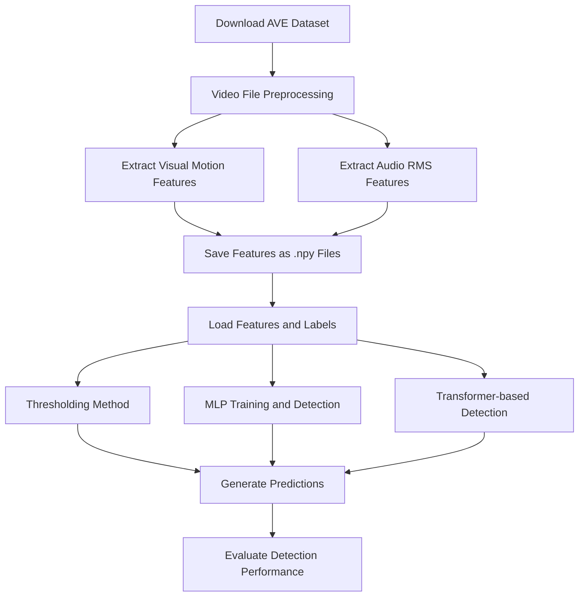

# Audio-Visual Synchronization Detection Workflow

## 1. Dataset Overview: AVE Dataset
- **Dataset Link**: [AVE Dataset - Official Website](https://sites.google.com/view/audiovisualresearch)
- **Size**: 4143 videos, covering 28 audio-visual event categories.
- **Labels**: Each video is split into 1-second segments with a label indicating whether audio and video are synchronized.
  - **Label Format**:
    - `1`: Synchronized
    - `0`: Not synchronized
- **Purpose**: Suitable for **supervised training** using 1-second segments as training samples.

---

## 2. Feature Extraction (Preprocessing Pipeline)

We extract features from both modalities:  
- **Visual Features**: Motion energy using optical flow.
- **Audio Features**: RMS energy using short-time Fourier transform (STFT).

**Fetching Labels from AVE Dataset**:  
Labels for each video are available from the official website. The labels are typically stored in a CSV or JSON format with 1-second granularity.

```python
# Example: Loading AVE labels from a CSV
import pandas as pd

# Assume labels are in a CSV file
labels_df = pd.read_csv("labels.csv")  # Load labels
labels = labels_df['label'].values  # Extract label array
```

## 3. Using AVE Labels: Training Supervised Models

Each video in the AVE dataset is split into **1-second segments** with corresponding labels.

- The label indicates whether audio and video are synchronized at that moment.
- These labeled segments can be used for **binary classification**: 
  - `1` for synchronized
  - `0` for desynchronized

---

## 4. Synchronization Detection Methods (Three Methods)

### Method 1: Simple Thresholding

**Idea**:
- Compare the audio and visual energy curves. If the difference is too large, we infer desynchronization.

**Mathematical Method**:
\[
\text{sync\_score}(t) = |V(t) - A(t)|
\]
- Set a threshold \(\theta\), and if \(\text{sync\_score}(t) < \theta\), classify as synchronized.

**Hyperparameter**:
- \(\theta\) can be optimized using a validation set.

---

### Method 2: MLP Classifier

**Input**:
- Concatenate visual features \(V(t)\) and audio features \(A(t)\).

**Network Architecture**:
- `Linear(2→32)` → ReLU → `Linear(32→16)` → ReLU → `Linear(16→2)` → Softmax

**Loss Function**:
- Cross-entropy loss

**Training**:
- The input features \([V(t), A(t)]\) are labeled as `1` or `0`.

```python
from sklearn.neural_network import MLPClassifier

# Assume X_train contains features, y_train contains labels
clf = MLPClassifier(hidden_layer_sizes=(32, 16), max_iter=500)
clf.fit(X_train, y_train)  # Train the MLP model
```

## Method 3: Lightweight Transformer

### Structure:

- Treat \([V(t), A(t)]\) as a sequence input to a Transformer.
- Add positional encoding using time-stamps.
- Use a classification head to predict synchronization.

### Loss:

- Cross-entropy loss

### Advantages:

- Can model temporal dependencies between segments, improving accuracy.

### Code Example:

```python
import torch
import torch.nn as nn

class SyncTransformer(nn.Module):
    def __init__(self):
        super(SyncTransformer, self).__init__()
        self.transformer = nn.Transformer()
        self.fc = nn.Linear(256, 2)

    def forward(self, x):
        x = self.transformer(x)
        return self.fc(x)
```

## 5. Complete Workflow Diagram

